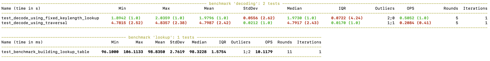

# Huffman

> Simple and straigthforward implementation of Huffman coding - as a small exercise.

Running the script as is, it performs all steps in the Huffman coding process on a predefined "hello world" string...

```bash
$ python -m huffman.coding
88 hello world
[('h', 1), ('e', 1), ('l', 3), ('o', 2), (' ', 1), ('w', 1), ('r', 1), ('d', 1)]
((((((('r', 1), ('d', 1)), 2), (((' ', 1), ('w', 1)), 2)), 4), ((('l', 3), ((((('h', 1), ('e', 1)), 2), ('o', 2)), 4)), 7)), 11)
 11
   4
     2
       ('r', 1)
       ('d', 1)
     2
       (' ', 1)
       ('w', 1)
   7
     ('l', 3)
     4
       2
         ('h', 1)
         ('e', 1)
       ('o', 2)
((('r', 'd'), (' ', 'w')), ('l', (('h', 'e'), 'o')))
{'r': '000', 'd': '001', ' ': '010', 'w': '011', 'l': '10', 'h': '1100', 'e': '1101', 'o': '111'}
32 0.36363636363636365 11001101101011101001111100010001
0001r1d01 1w01l001h1e1o
((('r', 'd'), (' ', 'w')), ('l', (('h', 'e'), 'o')))
{'000': 'r', '001': 'd', '010': ' ', '011': 'w', '10': 'l', '1100': 'h', '1101': 'e', '111': 'o'}
hello world
```

Command line arguments are considered a string...

```bash
$ python -m huffman.coding hello world from cli
160 hello world from cli
[('h', 1), ('e', 1), ('l', 4), ('o', 3), (' ', 3), ('w', 1), ('r', 2), ('d', 1), ('f', 1), ('m', 1), ('c', 1), ('i', 1)]
((((((((('c', 1), ('i', 1)), 2), ((('f', 1), ('m', 1)), 2)), 4), ('l', 4)), 8), ((((('r', 2), ('o', 3)), 5), (((' ', 3), ((((('w', 1), ('d', 1)), 2), ((('h', 1), ('e', 1)), 2)), 4)), 7)), 12)), 20)
 20
   8
     4
       2
         ('c', 1)
         ('i', 1)
       2
         ('f', 1)
         ('m', 1)
     ('l', 4)
   12
     5
       ('r', 2)
       ('o', 3)
     7
       (' ', 3)
       4
         2
           ('w', 1)
           ('d', 1)
         2
           ('h', 1)
           ('e', 1)
(((('c', 'i'), ('f', 'm')), 'l'), (('r', 'o'), (' ', (('w', 'd'), ('h', 'e')))))
{'c': '0000', 'i': '0001', 'f': '0010', 'm': '0011', 'l': '01', 'r': '100', 'o': '101', ' ': '110', 'w': '11100', 'd': '11101', 'h': '11110', 'e': '11111'}
68 0.425 11110111110101101110111001011000111101110001010010100111100000010001
00001c1i01f1m1l001r1o01 001w1d01h1e
(((('c', 'i'), ('f', 'm')), 'l'), (('r', 'o'), (' ', (('w', 'd'), ('h', 'e')))))
{'0000': 'c', '0001': 'i', '0010': 'f', '0011': 'm', '01': 'l', '100': 'r', '101': 'o', '110': ' ', '11100': 'w', '11101': 'd', '11110': 'h', '11111': 'e'}
hello world from cli
```

Download a large file, e.g. from [https://corpus.canterbury.ac.nz/descriptions/](https://corpus.canterbury.ac.nz/descriptions/) and provide it to the script...

```bash
$ make large
wget http://corpus.canterbury.ac.nz/resources/large.zip
--2020-08-22 10:37:09--  http://corpus.canterbury.ac.nz/resources/large.zip
Resolving corpus.canterbury.ac.nz (corpus.canterbury.ac.nz)... 132.181.17.8
Connecting to corpus.canterbury.ac.nz (corpus.canterbury.ac.nz)|132.181.17.8|:80... connected.
HTTP request sent, awaiting response... 302 Moved Temporarily
Location: https://corpus.canterbury.ac.nz/resources/large.zip [following]
--2020-08-22 10:37:09--  https://corpus.canterbury.ac.nz/resources/large.zip
Connecting to corpus.canterbury.ac.nz (corpus.canterbury.ac.nz)|132.181.17.8|:443... connected.
HTTP request sent, awaiting response... 200 OK
Length: 3256280 (3,1M) [application/zip]
Saving to: ‘large.zip’

large.zip            100%[===================>]   3,10M   366KB/s    in 8,8s    

2020-08-22 10:37:20 (361 KB/s) - ‘large.zip’ saved [3256280/3256280]

unzip large.zip -d large
Archive:  large.zip
  inflating: large/bible.txt         
  inflating: large/E.coli            
  inflating: large/world192.txt      

$ python -m huffman.coding large/bible.txt
32379136 bits
17747595 bits 0.5481182388560337 %
```

## Decoding Performance

My initial implementation for decoding used a dictionary with bitstrings as keys and the corresponding characters as values. It was a similar approach to the encoding logic. Due to not actually decoding the encoded bible, I didn't notice that this took ... like forever ;-)

I changed the implementation to one that takes the encoding tree and traverse it, based on the bits in the encoded stream, adding the character when arriving at a leaf. This proved to be much faster, but still rather slow. Nevertheless, it introduced me to pytext-benchmark:

```bash
$ make test
tox
GLOB sdist-make: /Users/xtof/Workspace/huffman/setup.py
py37 inst-nodeps: /Users/xtof/Workspace/huffman/.tox/.tmp/package/1/huffman-0.0.2.zip
py37 installed: attrs==20.1.0,certifi==2020.6.20,chardet==3.0.4,coverage==5.2.1,coveralls==2.1.2,docopt==0.6.2,huffman @ file:///Users/xtof/Workspace/huffman/.tox/.tmp/package/1/huffman-0.0.2.zip,idna==2.10,importlib-metadata==1.7.0,iniconfig==1.0.1,more-itertools==8.4.0,packaging==20.4,pluggy==0.13.1,py==1.9.0,py-cpuinfo==7.0.0,pyparsing==2.4.7,pytest==6.0.1,pytest-benchmark==3.2.3,requests==2.24.0,six==1.15.0,toml==0.10.1,urllib3==1.25.10,zipp==3.1.0
py37 run-test-pre: PYTHONHASHSEED='1916796342'
py37 run-test: commands[0] | coverage run -m '--omit=*/.tox/*,*/distutils/*,*/tests/*' pytest
=================================== test session starts ===================================
platform darwin -- Python 3.7.7, pytest-6.0.1, py-1.9.0, pluggy-0.13.1
cachedir: .tox/py37/.pytest_cache
benchmark: 3.2.3 (defaults: timer=time.perf_counter disable_gc=False min_rounds=5 min_time=0.000005 max_time=1.0 calibration_precision=10 warmup=False warmup_iterations=100000)
rootdir: /Users/xtof/Workspace/huffman, configfile: tox.ini, testpaths: tests
plugins: benchmark-3.2.3
collected 1 item                                                                          

tests/test_coding.py .                                                              [100%]


------------------------------------------- benchmark: 1 tests ------------------------------------------
Name (time in s)        Min     Max    Mean  StdDev  Median     IQR  Outliers     OPS  Rounds  Iterations
---------------------------------------------------------------------------------------------------------
test_roundtrip       4.6859  5.0134  4.8253  0.1543  4.7472  0.2770       1;0  0.2072       5           1
---------------------------------------------------------------------------------------------------------

Legend:
  Outliers: 1 Standard Deviation from Mean; 1.5 IQR (InterQuartile Range) from 1st Quartile and 3rd Quartile.
  OPS: Operations Per Second, computed as 1 / Mean
=================================== 1 passed in 39.77s ====================================
_________________________________________ summary _________________________________________
  py37: commands succeeded
  congratulations :)
```

Now this is going to prove to be addictive, giving me a very small piece of code to optimize to the moon and back ;-)

### Fixed Key Length Lookup Table

Going back to the dictionary mapping bitstrings to characters, extending the bitstrings to a fixed key length (of the longest key), adding duplicates for all missing bits after the key, proved to be a (though memory consuming) much faster way, slashing the decoding time roughly by two ;-)

So in stead of looking in this table:

```json
{
  '000': 'w',
  '001': ' ',
  '010': 'd',
  '011': 'h',
  '10': 'l',
  '1100': 'e',
  '1101': 'r',
  '111': 'o'
}
```

I'm now looking in this table:

```json
{
  '0000': ('w', 3), '0001': ('w', 3),
  '0010': (' ', 3), '0011': (' ', 3),
  '0100': ('d', 3), '0101': ('d', 3),
  '0110': ('h', 3), '0111': ('h', 3),
  '1000': ('l', 2), '1001': ('l', 2), '1010': ('l', 2), '1011': ('l', 2),
  '1100': ('e', 4),
  '1101': ('r', 4),
  '1110': ('o', 3), '1111': ('o', 3)}
```

It allows us to consume a fixed amount of bits from the code, ensures that the lookup table will always return a match, including the characters and the actual amount of bits that have to be consumed from the code.



Building the lookup table takes little time, in comparison with the gain in decoding time.

## TODO
- implement it with "real bits" ;-) 

## References

* [https://en.wikipedia.org/wiki/Huffman_coding](https://en.wikipedia.org/wiki/Huffman_coding)
